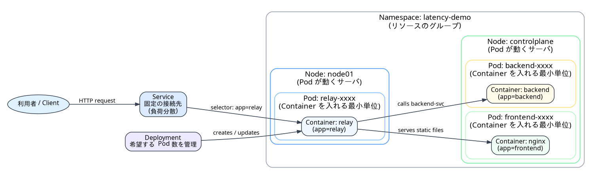

### トラブル発生
トラブルが発生し、Webアクセスが遅くなっています。Webの状況確認を行い、原因を調査し、元の性能に戻してください。

👉 [Webページを開く]({{TRAFFIC_HOST1_30081}})

kubernetesの構造と役立つコマンド群は以下です。**置き換えが必要なコマンドはEditorタブで編集するなどして貼ってください。（ターミナル上で書き換えると失敗しやすいです）**



### ノード・Pod・Deployment の状態を確認する

```bash
# ノード一覧と詳細情報（IP、OS、バージョンなど）を表示
kubectl get nodes -o wide

# 全NamespaceのPod一覧と詳細情報を表示
kubectl get pods -A -o wide

# 特定Namespace（例: latency-demo）のDeployment一覧を表示
kubectl -n latency-demo get deploy

# ノードの詳細情報（割り当てリソース、条件、イベント等）を表示
kubectl describe nodes
```

📌 **補足**

* describe は状態だけでなく **イベント（トラブルシュート時に重要）** も確認できる
* Pod は通常 **Deployment / ReplicaSet によって管理** されている

---

### リソース使用量（CPU / メモリ）を確認する

```bash
# ノードごとのリソース使用量を表示
kubectl top nodes

# 全NamespaceのPodごとのリソース使用量を表示
kubectl top pods -A

# 特定NamespaceのPodごとのリソース使用量を表示
kubectl -n latency-demo top pods
```

📌 **注意点**

* kubectl top は **metrics-server がクラスタにデプロイされていることが前提**
* metrics-server が無い場合はエラーになる

---

### Pod の詳細情報・イベントを確認する

```bash
# Pod の詳細情報（ステータス、コンテナ、イベントなど）を表示
kubectl -n latency-demo describe pod <pod名>
```

📌 **補足**

* <pod名> は以下で確認

  ```bash
  kubectl get pods -n latency-demo
  ```
* 起動失敗・再起動ループの原因調査に有効

---

### Pod のログを確認する

```bash
# Pod のログを表示（単一コンテナの場合）
kubectl -n latency-demo logs <pod名>
```

📌 **補足・注意点**

* 複数コンテナを持つ Pod の場合は -c <container名>(relay, backend, nginx) が必要
* 過去のログを見たい場合は --previous を使用

---

### Deployment のスケール操作（Pod 数の増減）

```bash
# Pod を起動（Deployment のレプリカ数を 1 にする）
kubectl -n latency-demo scale deploy/<deploy名> --replicas=1

# Pod を停止（Deployment のレプリカ数を 0 にする）
kubectl -n latency-demo scale deploy/<deploy名> --replicas=0
```

📌 **補足**

* <deploy名> は以下で確認

  ```bash
  kubectl -n latency-demo get deploy
  ```
* Pod を直接起動／停止しているわけではない
* Deployment の **desired replicas（希望Pod数）** を変更している
* Pod は Kubernetes が **自動的に作成・削除** する

---

### Pod を指定してコンテナ内でコマンドを実行する（例: ls）

```bash
kubectl -n latency-demo exec <pod名> -- ls
```

📌 **補足**

* 単発コマンド実行向け
* Pod 内に複数コンテナがある場合は `-c <container名>` を指定

---

### Pod を指定してコンテナにログイン（シェル接続）

```bash
kubectl -n latency-demo exec -it <pod名> -- /bin/bash
```

📌 **注意点**

* /bin/bash が存在しないイメージでは失敗する

  * その場合は /bin/sh を使用
* 本番環境では **exec ログインを制限している場合** がある

---
